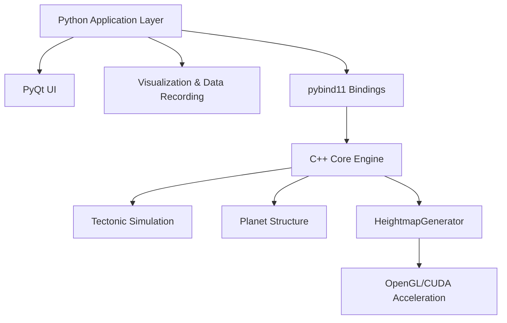
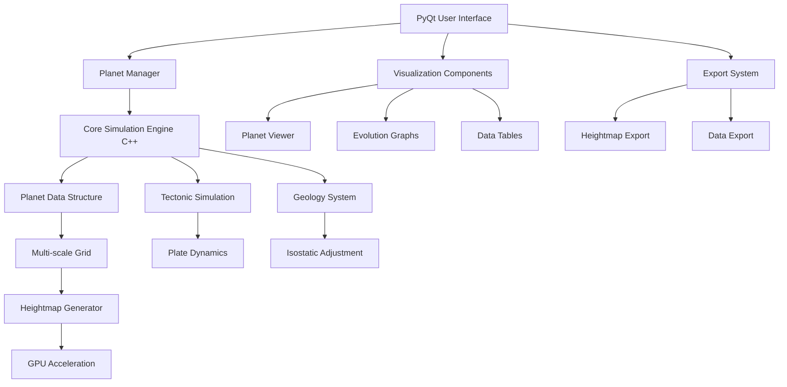
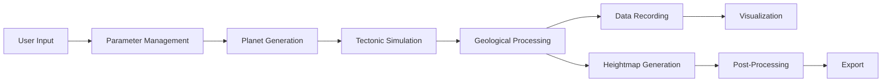
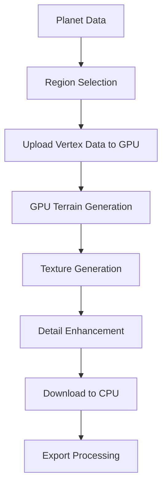
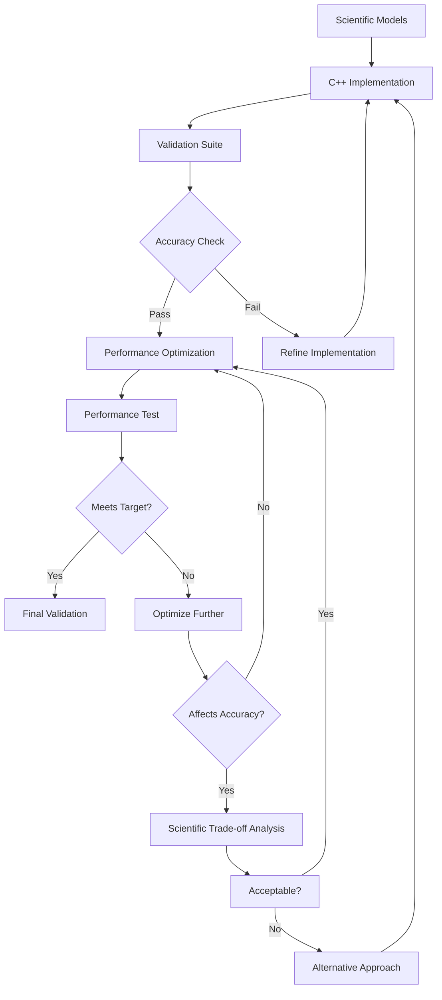
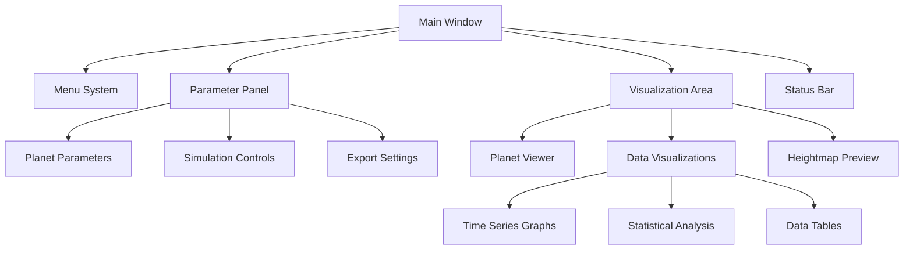

# Technical Plan: AeonTerra C++ Integration for Heightmap Generation

## 1. Executive Summary

This document outlines the comprehensive technical plan for integrating C++ into the AeonTerra procedural planet generation system, with a focus on high-performance heightmap generation. The plan prioritizes scientifically accurate planet formation and tectonic activity simulation while delivering significant performance improvements through C++ and GPU acceleration.

The primary objectives are:
1. Develop a robust C++ implementation for core planetary simulation components
2. Create a high-performance heightmap generation pipeline
3. Maintain scientific accuracy throughout the optimization process
4. Implement a high-performance PyQt-based user interface
5. Provide visualization and data recording capabilities

This approach will address current performance bottlenecks, enable higher resolution simulations, and provide a solid foundation for future feature development.

## 2. Current System Analysis

### 2.1 Performance Bottlenecks

The current Python implementation faces several challenges:

| Aspect | Current Limitation | Target Improvement |
|--------|-------------------|-------------------|
| Memory Usage | ~2.5GB at resolution 7 | <500MB at resolution 7 |
| Tectonic Simulation | ~30s per step at resolution 5 | <5s per step at resolution 5 |
| Heightmap Generation | ~2 min for 4K resolution | <10s for 4K resolution |
| Maximum Resolution | Practical limit around resolution 7 | Support for resolution 9+ |
| Heightmap Output | Limited to ~4K | Support for 16K+ |

### 2.2 Core Functionality Requirements

1. **Planet Formation**: Scientifically accurate initial planet generation
2. **Tectonic Simulation**: Realistic plate tectonics and geological processes
3. **Heightmap Generation**: High-resolution terrain extraction from planetary data
4. **User Interface**: Intuitive PyQt-based UI for parameter control and visualization
5. **Data Recording**: Graphing and tabular data on planet evolution

## 3. Technology Stack

### 3.1 Core Technologies



### 3.2 Technology Selection

| Component | Selected Technology | Justification |
|-----------|---------------------|---------------|
| Python Framework | Python 3.10+ | Current codebase compatibility |
| UI Framework | PyQt6 | High performance, desktop-oriented |
| C++ Standard | C++17 | Modern features with wide compiler support |
| Binding Technology | pybind11 | Lightweight, modern Python-C++ binding |
| Linear Algebra | Eigen 3 | High-performance template library |
| GPU Computing | CUDA + OpenGL | Best performance for scientific computing |
| Build System | CMake | Cross-platform, industry standard |
| Visualization | Matplotlib + PyQtGraph | Scientific plotting capabilities |
| Testing Framework | Catch2 (C++) + pytest (Python) | Comprehensive testing coverage |

### 3.3 Development Environment

- **Operating System**: Primary development on Linux, with Windows support
- **IDE**: Support for VS Code and CLion
- **Containerization**: Docker environment for consistent builds
- **Version Control**: Git with feature-branch workflow
- **CI/CD**: GitHub Actions or Jenkins for automated testing and builds

## 4. System Architecture

### 4.1 High-Level Architecture



### 4.2 Component Relationships

1. **UI Layer**: User interaction, visualization, parameter control
2. **Core Engine**: C++ implementation of planet simulation
3. **GPU Acceleration**: Heightmap generation and processing
4. **Data Management**: Storage, retrieval, and visualization of planet data

### 4.3 Data Flow



## 5. C++ Implementation Plan

### 5.1 Core Components to Convert

| Component | Priority | Complexity | Performance Impact |
|-----------|----------|------------|-------------------|
| SphericalGrid | High | Medium | High |
| Planet Data Structure | High | Medium | High |
| Tectonic Simulation | High | High | Very High |
| Heightmap Generation | Highest | High | Very High |
| Isostatic Calculation | Medium | Medium | High |
| Property Management | Medium | Low | Medium |

### 5.2 Conversion Strategy

1. **Incremental Approach**:
   - Start with self-contained components (SphericalGrid)
   - Create identical interfaces for Python interaction
   - Validate each component before moving to the next
   - Replace Python implementations component by component

2. **Interface Design**:
   - Clean, well-defined C++ interfaces
   - Consistent parameter passing conventions
   - Exception handling for robust error management
   - Comprehensive documentation of all interfaces

3. **Performance Considerations**:
   - Cache-friendly data structures
   - SIMD-optimized operations where applicable
   - Multi-threaded implementation for core algorithms
   - Memory-efficient property storage

### 5.3 Key C++ Classes

#### 5.3.1 SphericalGrid Class

```cpp
class SphericalGrid {
private:
    // Core geometry
    std::vector<Vec3> vertices;
    std::vector<Vec3i> faces;
    std::vector<std::vector<int>> neighbors;
    
    // Spatial indexing
    std::unique_ptr<SpatialIndex> spatialIndex;
    
    // Grid properties
    float radius;
    int resolution;
    
public:
    // Constructor
    SphericalGrid(float radius, int resolution);
    
    // Core functionality
    void subdivide(int levels);
    const std::vector<int>& getNeighbors(int vertexIdx) const;
    std::vector<int> getVerticesInRegion(const BoundingBox& region) const;
    
    // Coordinate conversion
    Vec3 latLonToCartesian(float lat, float lon) const;
    std::pair<float, float> cartesianToLatLon(const Vec3& position) const;
    
    // Accessors
    size_t getVertexCount() const;
    const Vec3& getVertex(int idx) const;
    const Vec3i& getFace(int idx) const;
};
```

#### 5.3.2 Planet Class

```cpp
class Planet {
private:
    // Core data
    SphericalGrid grid;
    
    // Properties (using SOA layout for performance)
    std::vector<float> elevation;
    std::vector<float> crustThickness;
    std::vector<float> crustDensity;
    std::vector<int> crustType;
    std::vector<int> plateId;
    
    // Metadata
    double age; // Million years
    std::string name;
    
    // History tracking
    std::vector<HistoricalSnapshot> history;
    
public:
    // Constructor
    Planet(float radius, int resolution, const std::string& name = "AeonTerra");
    
    // Property access
    float getElevation(int vertexIdx) const;
    void setElevation(int vertexIdx, float value);
    // Other property accessors...
    
    // Grid access
    const SphericalGrid& getGrid() const;
    
    // Simulation control
    void advanceAge(double timeStep);
    void recordSnapshot();
    
    // History access
    const std::vector<HistoricalSnapshot>& getHistory() const;
    
    // Serialization
    void saveToFile(const std::string& filename) const;
    static Planet loadFromFile(const std::string& filename);
};
```

#### 5.3.3 TectonicSimulation Class

```cpp
class TectonicSimulation {
private:
    // Reference to planet
    Planet& planet;
    
    // Plate data
    std::vector<TectonicPlate> plates;
    
    // Mantle dynamics
    std::vector<ConvectionCell> convectionCells;
    
    // Simulation parameters
    struct {
        float mantleDensity;
        float oceanicDensity;
        float continentalDensity;
        float tectonicActivityScale;
    } params;
    
    // Threading support
    ThreadPool threadPool;
    
public:
    // Constructor
    TectonicSimulation(Planet& planet, int numPlates);
    
    // Setup methods
    void initializePlates();
    void initializeMantle(int numCells);
    
    // Simulation methods
    void simulateStep(double timeStep);
    
    // Analysis methods
    std::vector<int> getBoundaryVertices() const;
    PlateInteractionType getInteractionType(int v1, int v2) const;
    
    // Accessors
    const std::vector<TectonicPlate>& getPlates() const;
    
    // Parameter control
    void setTectonicActivity(float value);
};
```

#### 5.3.4 HeightmapGenerator Class

```cpp
class HeightmapGenerator {
private:
    // OpenGL resources
    GLuint heightmapTexture;
    GLuint shaderProgram;
    
    // Memory management
    size_t maxBufferSize;
    
    // Tile management
    int tileSize;
    int tileOverlap;
    
public:
    // Constructor
    HeightmapGenerator(int maxResolution = 16384);
    
    // Heightmap generation
    HeightmapData generateHeightmap(
        const Planet& planet,
        const BoundingBox& region,
        int width, int height
    );
    
    // Detail enhancement
    void enhanceDetail(
        HeightmapData& heightmap,
        float roughness,
        int octaves
    );
    
    // Export methods
    void exportPNG(
        const HeightmapData& heightmap,
        const std::string& filename,
        bool normalizeValues = true
    );
    
    void exportTIFF(
        const HeightmapData& heightmap,
        const std::string& filename,
        int bitDepth = 16
    );
};
```

## 6. GPU Acceleration Strategy

### 6.1 Heightmap Generation Pipeline



### 6.2 Tiled Processing for Large Heightmaps

For heightmaps exceeding GPU memory capacity:

1. **Divide and Conquer**:
   - Split region into manageable tiles
   - Process each tile with overlap regions
   - Stitch tiles together seamlessly

2. **Memory Management**:
   - Dynamically adjust tile size based on available GPU memory
   - Prioritize critical data transfer
   - Optimize texture formats for memory efficiency

3. **Load Balancing**:
   - Process multiple tiles in parallel when possible
   - Balance CPU and GPU workloads
   - Efficient task scheduling

### 6.3 OpenGL Shader Implementation

```glsl
// Core heightmap generation compute shader
#version 450 core

layout(local_size_x = 16, local_size_y = 16) in;
layout(binding = 0, r32f) uniform image2D heightMap;

// Planet data buffers
layout(std140, binding = 1) buffer VertexBuffer {
    vec4 vertices[];
};

layout(std140, binding = 2) buffer ElevationBuffer {
    float elevations[];
};

// Region parameters
uniform vec4 region; // (latMin, lonMin, latMax, lonMax)
uniform int vertexCount;
uniform float planetRadius;

// Helper functions
vec3 latLonToCartesian(float lat, float lon);
int findNearestVertices(vec3 position, out vec4 weights);

void main() {
    // Get heightmap coordinates
    ivec2 pixel = ivec2(gl_GlobalInvocationID.xy);
    ivec2 size = imageSize(heightMap);
    
    if(pixel.x >= size.x || pixel.y >= size.y) {
        return;
    }
    
    // Convert to lat/lon
    float lat = mix(region.x, region.z, float(pixel.y) / float(size.y - 1));
    float lon = mix(region.y, region.w, float(pixel.x) / float(size.x - 1));
    
    // Convert to 3D position
    vec3 position = latLonToCartesian(radians(lat), radians(lon));
    
    // Find nearest vertices and interpolation weights
    vec4 weights;
    int baseVertex = findNearestVertices(position, weights);
    
    // Interpolate elevation
    float elevation = 0.0;
    for(int i = 0; i < 4; i++) {
        if(weights[i] > 0.0) {
            elevation += elevations[baseVertex + i] * weights[i];
        }
    }
    
    // Store the result
    imageStore(heightMap, pixel, vec4(elevation, 0.0, 0.0, 0.0));
}
```

## 7. Scientific Accuracy Preservation

### 7.1 Validation Framework



### 7.2 Numerical Precision Strategy

| Calculation Type | Implementation Approach | Rationale |
|------------------|-------------------------|-----------|
| Coordinate calculations | 64-bit double precision | Essential for accurate spherical geometry |
| Elevation calculations | 32-bit float with selective 64-bit | Balance of performance and accuracy |
| Plate dynamics | Eigen with double precision | Critical for rotation accuracy |
| Isostatic adjustment | 64-bit calculation, 32-bit storage | Accuracy in key geological calculations |
| Region interpolation | Barycentric with double precision | Accurate data transfer to heightmaps |

### 7.3 Scientific Validation Metrics

| Feature | Validation Method | Acceptance Criteria |
|---------|-------------------|-------------------|
| Tectonic movement | Drift vectors comparison | <1% deviation from reference |
| Mountain formation | Height and distribution | Statistical similarity (p > 0.95) |
| Isostatic equilibrium | Crust/elevation relationship | <0.5% error in equilibrium height |
| Continental shapes | Fractal dimension | Within 0.05 of reference dimension |
| Geological features | Feature detection and classification | >95% feature preservation |

### 7.4 Performance-Accuracy Tradeoffs

For each optimization:

1. Establish baseline accuracy metrics
2. Implement performance optimization
3. Measure impact on accuracy
4. Accept only if accuracy remains within tolerance
5. Document tradeoffs made for transparency

## 8. User Interface Design

### 8.1 PyQt-Based Interface



### 8.2 UI Components

#### 8.2.1 Parameter Controls

- **Planet Configuration**:
  - Planet size, radius, gravity
  - Initial crust composition
  - Tectonic activity level
  - Number of tectonic plates
  
- **Simulation Controls**:
  - Time step size
  - Run/pause/step controls
  - Simulation speed
  - Save/load functionality
  
- **Heightmap Generation**:
  - Region selection (interactive or coordinate input)
  - Resolution selection
  - Detail enhancement options
  - Export format settings

#### 8.2.2 Visualization Components

- **3D Planet Viewer**:
  - Interactive rotation and zoom
  - Color modes (elevation, plate ID, crust type)
  - Feature highlighting
  - Time series animation
  
- **Data Graphs**:
  - Elevation histogram
  - Land/ocean percentage over time
  - Plate movement rates
  - Continental drift visualization
  
- **Data Tables**:
  - Plate statistics
  - Geological features inventory
  - Simulation metrics

#### 8.2.3 Export System

- **Heightmap Export**:
  - Format selection (PNG, TIFF, RAW)
  - Bit depth options (8, 16, 32-bit)
  - Normalization settings
  - Batch export capability
  
- **Data Export**:
  - CSV export of time series data
  - JSON export of simulation parameters
  - Complete planet state serialization

### 8.3 Interface Implementation

Using PyQt6 for optimal desktop performance:

```python
class MainWindow(QMainWindow):
    def __init__(self):
        super().__init__()
        self.setWindowTitle("AeonTerra Planetary Generator")
        
        # Core simulation components
        self.planet_manager = PlanetManager()
        
        # Set up UI components
        self.setup_ui()
        
        # Connect signals
        self.connect_signals()
        
    def setup_ui(self):
        # Main layout
        main_widget = QWidget()
        self.setCentralWidget(main_widget)
        layout = QHBoxLayout(main_widget)
        
        # Parameter panel (left side)
        self.parameter_panel = ParameterPanel(self.planet_manager)
        layout.addWidget(self.parameter_panel, 1)
        
        # Visualization area (right side)
        self.vis_area = VisualizationArea(self.planet_manager)
        layout.addWidget(self.vis_area, 3)
        
        # Menu bar
        self.setup_menu()
        
        # Status bar
        self.status_bar = QStatusBar()
        self.setStatusBar(self.status_bar)
        
    def connect_signals(self):
        # Connect various UI signals to handlers
        self.parameter_panel.parameter_changed.connect(self.handle_parameter_change)
        self.vis_area.region_selected.connect(self.handle_region_selection)
        # More signal connections...
```

## 9. Data Recording and Visualization

### 9.1 Data Recording Strategy

1. **Time Series Data**:
   - Regular snapshots of key planetary metrics
   - Efficient storage using compressed formats
   - Automatic pruning of high-frequency data for long simulations

2. **Geological Event Recording**:
   - Major tectonic events (collisions, rifting)
   - Mountain building episodes
   - Statistical aggregation for long-term trends

3. **State Snapshots**:
   - Complete serialization of planet state at key intervals
   - Restoration points for simulation exploration
   - Compact binary format for efficiency

### 9.2 Visualization Capabilities

1. **Time Series Graphs**:
   - Interactive matplotlib-based plotting
   - Multiple metrics on single graphs
   - Zoom and pan capabilities
   - Export to common formats

2. **Planet Evolution Visualization**:
   - Time-lapse animation of planet development
   - Heat map visualization of changes
   - Plate movement vectors and boundaries

3. **Statistical Analysis**:
   - Histogram of elevation distribution
   - Continental vs oceanic crust metrics
   - Mountain range height profiles

### 9.3 Implementation Approach

```python
class DataRecorder:
    """Records and manages planetary data over time"""
    
    def __init__(self, planet_manager):
        self.planet_manager = planet_manager
        self.time_series = {}
        self.events = []
        self.snapshots = {}
    
    def record_snapshot(self):
        """Record current planetary state"""
        planet = self.planet_manager.get_planet()
        age = planet.get_age()
        
        # Record basic metrics
        metrics = {
            'age': age,
            'land_percentage': self.calculate_land_percentage(planet),
            'max_elevation': self.get_max_elevation(planet),
            'min_elevation': self.get_min_elevation(planet),
            'plate_movement': self.calculate_plate_movement(planet),
            # Additional metrics...
        }
        
        # Store in time series
        for key, value in metrics.items():
            if key not in self.time_series:
                self.time_series[key] = []
            self.time_series[key].append((age, value))
        
        # Record major events
        events = self.detect_events(planet)
        self.events.extend(events)
        
        # Take full snapshot at designated intervals
        if self.should_take_full_snapshot(age):
            self.snapshots[age] = planet.create_snapshot()
    
    def create_visualization(self, metric, start_age=None, end_age=None):
        """Create visualization for a specific metric"""
        # Implementation to create matplotlib figure
        # with the requested time series data
```

## 10. Implementation Timeline

### 10.1 Phase 1: Foundation (Months 1-2)

1. **Core C++ Structure**:
   - Basic CMake build system
   - pybind11 integration
   - SphericalGrid implementation
   - Planet class skeleton

2. **Python-C++ Interface**:
   - Base binding layer
   - Data conversion utilities
   - Initial testing framework

3. **Development Environment**:
   - Docker containerization
   - CI pipeline setup
   - Automated testing

### 10.2 Phase 2: Core Simulation (Months 3-4)

1. **Tectonic System**:
   - Plate generation
   - Basic movement simulation
   - Boundary interaction
   - Isostatic adjustment

2. **UI Framework**:
   - PyQt window structure
   - Parameter controls
   - Basic visualization

3. **Data Recording**:
   - Time series recording
   - Basic graphs and visualization

### 10.3 Phase 3: Heightmap Generation (Months 5-6)

1. **GPU Infrastructure**:
   - OpenGL setup
   - CUDA integration
   - Memory management
   - Basic shader pipeline

2. **Heightmap Generator**:
   - Region selection
   - Basic interpolation
   - Tiled processing for large heightmaps

3. **Export System**:
   - PNG/TIFF/RAW export
   - Metadata handling
   - Batch processing

### 10.4 Phase 4: Refinement and Optimization (Months 7-8)

1. **Performance Optimization**:
   - Profiling and bottleneck identification
   - SIMD optimization for critical paths
   - Memory usage optimization
   - Multi-threading improvements

2. **UI Enhancement**:
   - Advanced visualization
   - Interactive controls
   - Complete data graphs and tables

3. **Scientific Validation**:
   - Comprehensive validation suite
   - Accuracy metrics
   - Documentation of results

## 11. Risk Assessment and Mitigation

| Risk | Impact | Likelihood | Mitigation Strategy |
|------|--------|------------|---------------------|
| Performance gains insufficient | High | Medium | Progressive optimization, fallback strategies |
| GPU compatibility issues | High | Medium | Abstract GPU interface, fallback to CPU |
| Scientific accuracy degradation | High | Low | Rigorous validation system, regression testing |
| UI complexity slowing development | Medium | Medium | Incremental UI development, separate from core engine |
| Memory limitations for large planets | High | Medium | Streaming techniques, level-of-detail management |

## 12. Conclusion

This technical plan provides a comprehensive roadmap for enhancing AeonTerra's performance and capabilities through C++ integration. By focusing on scientifically accurate planet formation and tectonic processes, high-performance heightmap generation, and a robust PyQt user interface, we can create a significantly improved system that maintains scientific integrity while delivering substantial performance gains.

The phased implementation approach allows for incremental validation and refinement, ensuring that each component meets both performance and accuracy requirements. The well-defined architecture provides clear separation of concerns, making the system maintainable and extensible for future enhancements.

This plan prioritizes the core requirements specified:
1. Optimal tech stack for heightmap generation
2. Framework selection balancing performance and flexibility
3. Strategy for converting critical Python components to C++
4. Architecture for parameter-driven terrain customization
5. Integration approach between Python and C++ components
6. Performance optimization for large-scale terrain generation

Additionally, it addresses the specific UI and data recording requirements to provide users with a comprehensive, high-performance toolset for planetary simulation and exploration.